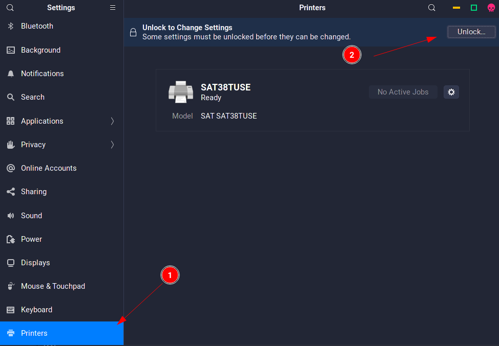
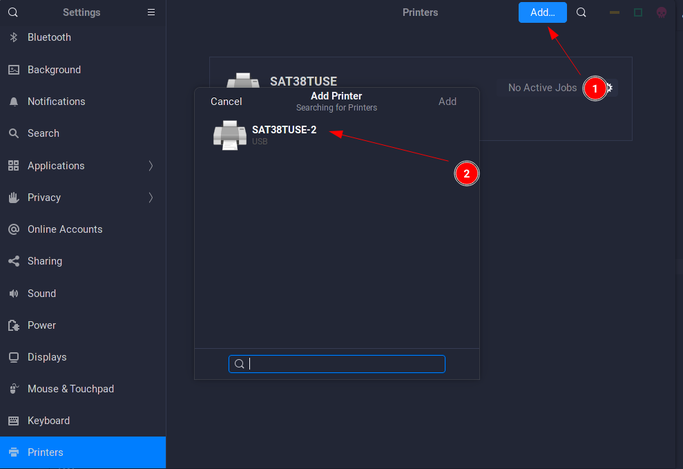
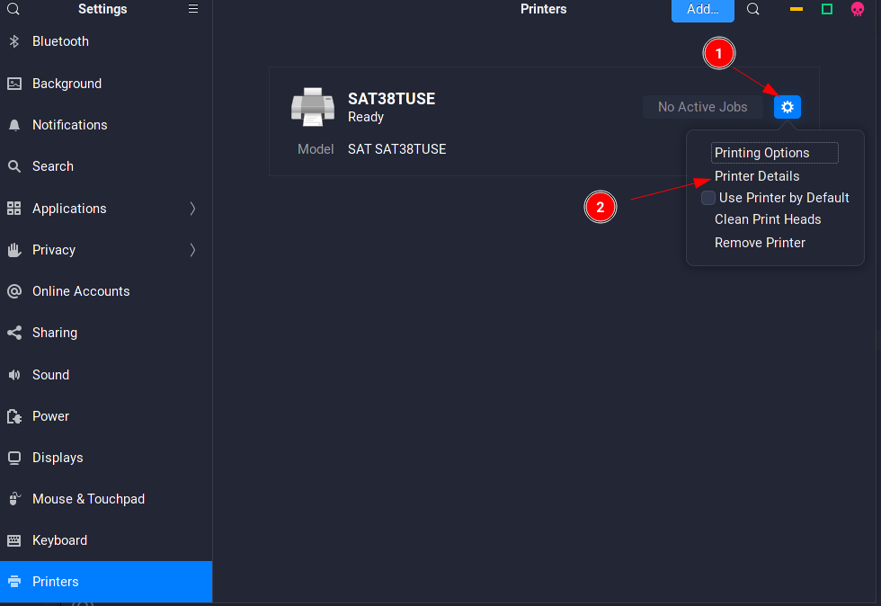
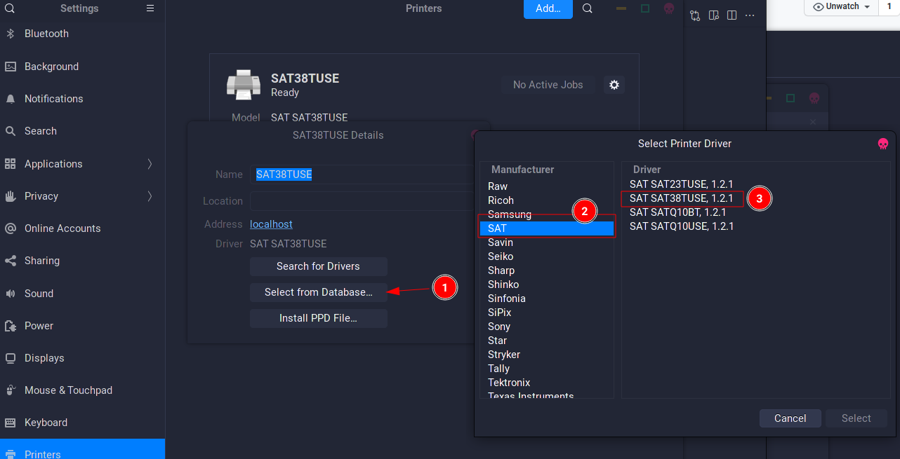

# Drivers SAT impresora para Linux

- sat23tuse.ppd
- sat38tuse.ppd
- satq10bt.ppd
- satq10use.ppd

## Como instalar:
ir a la carpeta y correr `./install` 

Nota: debe estar en la carpeta descargada

## Como usar en Gnome:

### 1 

### 2

### 3

### 4

Eso es todo, ya se puede utilizar la impresora en los cuadros de impresión de las diferentes aplicaciones.
